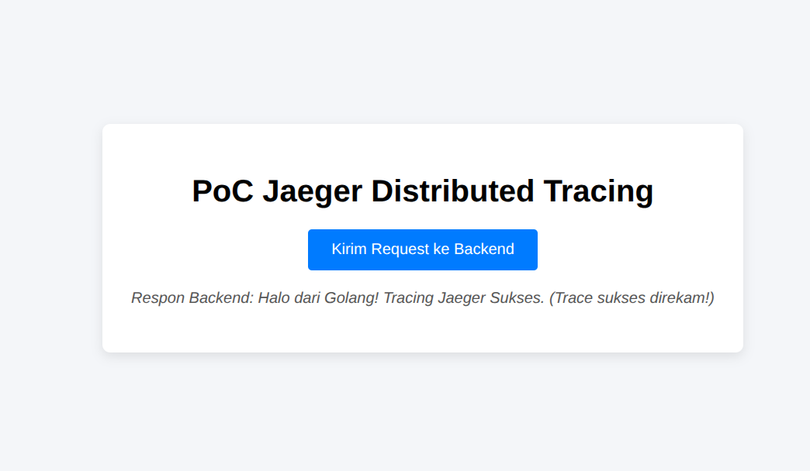
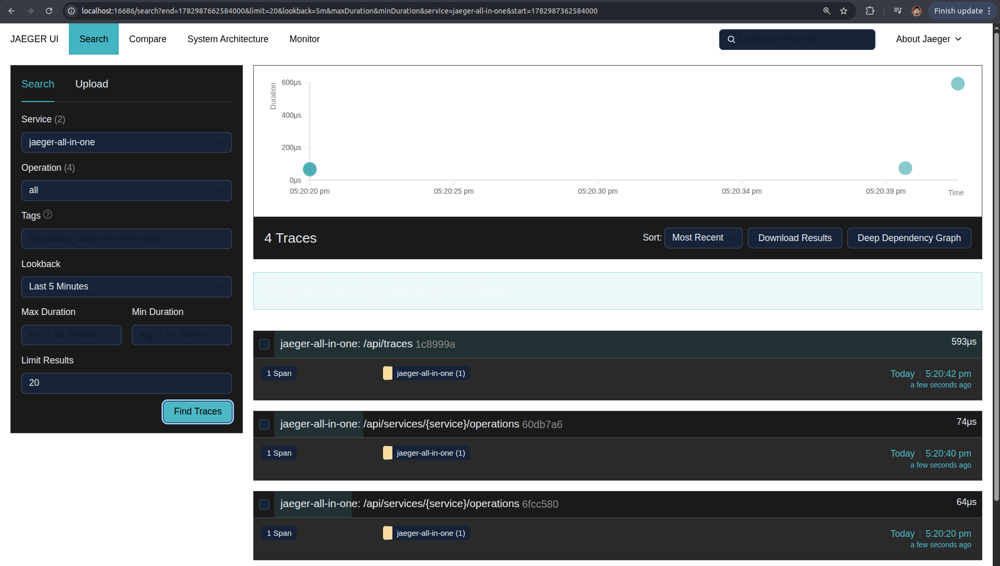
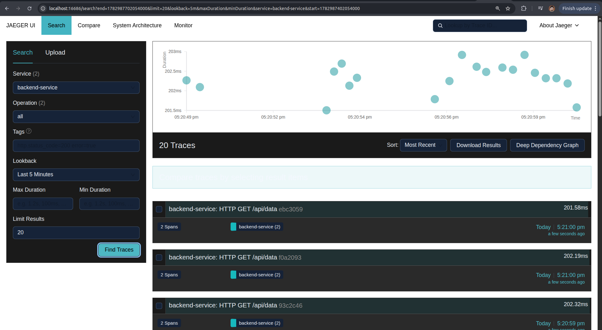
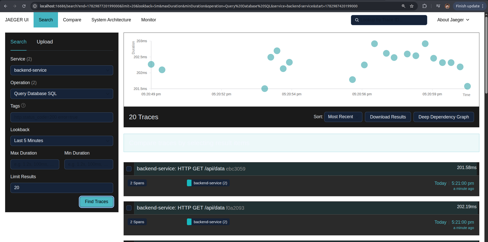

# PoC Jaeger Distributed Tracing (Golang & Frontend)
 
Project ini adalah *Proof of Concept* (PoC) sederhana untuk mengimplementasikan distributed tracing menggunakan **Jaeger** sebagai trace visualization backend dan **OpenTelemetry (OTel)** pada backend **Golang**.
 
## 🏗️ Struktur Folder
 
```text
tracing-jaeger-poc/
├── frontend/
│   ├── index.html       # Tampilan UI & Trigger HTTP Request
│   └── style.css        # Styling dasar UI
├── backend/
│   ├── go.mod           # Dependency Go
│   ├── go.sum
│   └── main.go          # Server Go + OpenTelemetry Engine
└── docker-compose.yml   # Orchestrator untuk menjalankan Jaeger All-in-One
```
 
## 🚀 Prasyarat Sebelum Menjalankan
 
Pastikan komponen berikut sudah terinstal di komputer Anda:
 
- Docker & Docker Compose
- Go (Golang) v1.18 ke atas
- Web Server Lokal untuk Frontend (misal: Extension *Live Server* di VS Code, atau Python `http.server`)
## 🛠️ Langkah Menjalankan Proyek
 
### 1. Jalankan Jaeger (Docker)
 
Buka terminal di root folder project (`poc-jaeger-tracing/`), lalu jalankan perintah berikut untuk mengunduh dan menyalakan Jaeger:
 
```bash
docker compose up -d
```
 
Untuk memastikan Jaeger berjalan, Anda bisa mengecek apakah kontainer aktif via `docker ps`.
 
### 2. Jalankan Backend (Golang)
 
Pindah ke folder `backend`, unduh semua dependency OpenTelemetry yang dibutuhkan, lalu jalankan aplikasinya:
 
```bash
cd backend
go mod tidy
go run main.go
```
 
Backend akan aktif dan berjalan di alamat `http://localhost:8085`.
 
### 3. Jalankan Frontend (HTML/JS)
 
Karena alasan keamanan browser (CORS & Origin policy), file `index.html` wajib dijalankan menggunakan local web server.
 
**Opsi A (Rekomendasi):** Jika menggunakan VS Code, klik kanan pada file `frontend/index.html` → pilih **Open with Live Server**.
 
**Opsi B (Terminal):** Buka terminal baru, masuk ke folder `frontend`, lalu jalankan:
 
```bash
python3 -m http.server 8080
```
 
Buka browser Anda dan akses `http://localhost:8080`.
 
## 📊 Cara Menguji Tracing
 
1. Buka halaman frontend di browser (`http://localhost:8080` atau port Live Server Anda).



2. Klik tombol **"Kirim Request ke Backend"** beberapa kali.
3. Buka Dashboard UI Jaeger di alamat: `http://localhost:16686`.



4. Pada panel pencarian di sebelah kiri:
   - Pilih dropdown **Service** → cari dan pilih `backend-service`.
   - Klik tombol **Find Traces** di bagian bawah panel tersebut.
   


5. Klik salah satu baris trace hasil pencarian untuk melihat visualisasi detail eksekusi fungsi HTTP Handler hingga simulasi query database (*Query Database SQL*).



